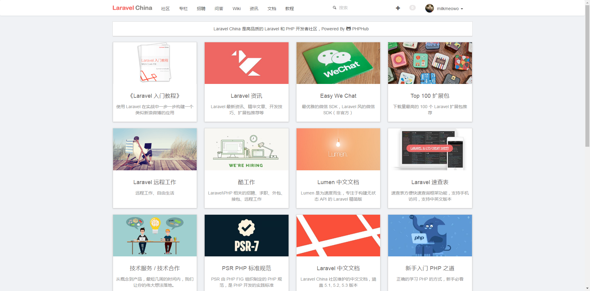
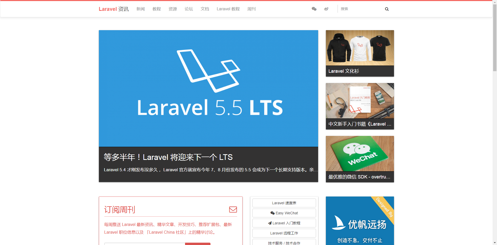
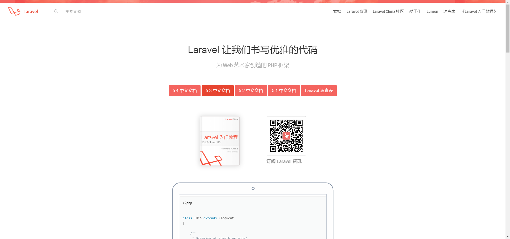
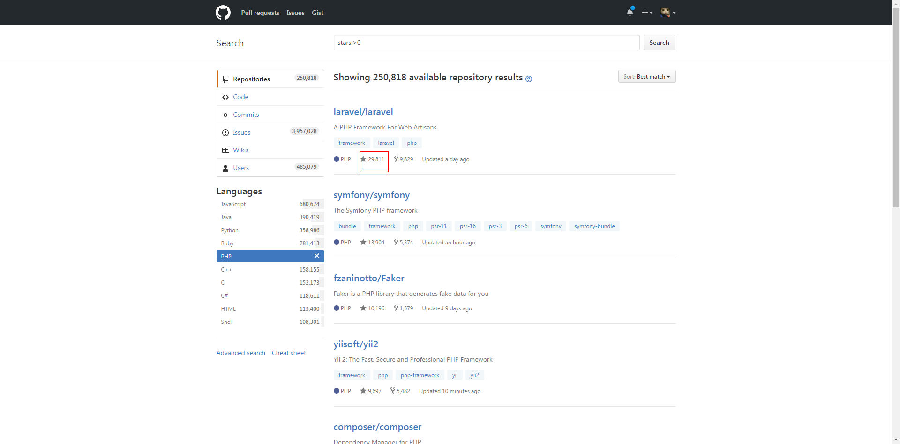
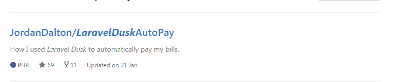
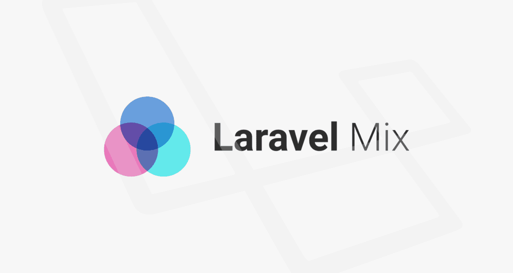
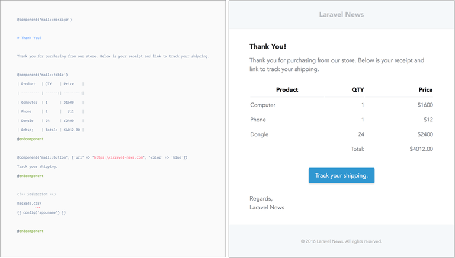
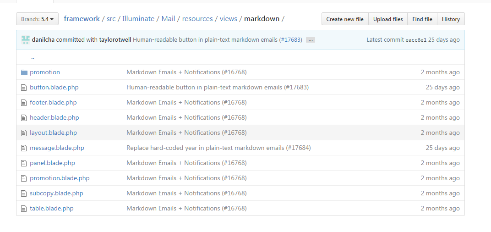
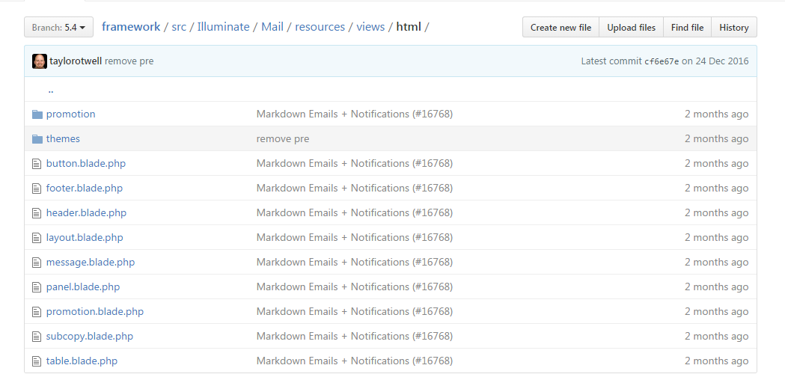
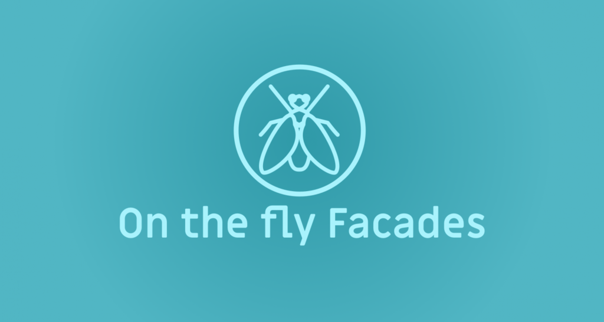

## [Laravel China](https://laravel-china.org/) 社区



--<n>--

## [Laravel 资讯](https://news.laravel-china.org/)



--<n>--

## [Laravel 文档](https://laravel-china.org/docs/home)



--<n>--

Github Star

 

--<n>--

--<n>--

Author: Taylor Otwell <!-- .element: style="font-size: 2em" -->


--<n>--

<!-- 这里可以用section -->

###发布里程 <!-- .element: style="margin-left: 200px;" -->

- 2011年6月  1.0.0 Beta<!-- .element: class="fragment" data-fragment-index="1" -->
- 2011年11月 2.0发布 <!-- .element: class="fragment" data-fragment-index="2" -->
- 2013年5月  3.2发布 <!-- .element: class="fragment" data-fragment-index="3" -->
- 2013年12月 4.0发布 <!-- .element: class="fragment" data-fragment-index="4" -->
- 2015年2月 5.0发布 <!-- .element: class="fragment" data-fragment-index="5" -->
- 2015年6月 5.1发布 <!-- .element: class="fragment" data-fragment-index="6" -->
- 2015年12月 5.2发布 <!-- .element: class="fragment" data-fragment-index="7" -->
- 2016年8月 5.3发布 <!-- .element: class="fragment" data-fragment-index="8" -->
- 2017年1月 5.4发布 <!-- .element: class="fragment" data-fragment-index="9" -->
- 到目前为止最新版本是5.4.9 <!-- .element: class="fragment" data-fragment-index="10" -->

....  <!-- .element: class="fragment" data-fragment-index="11"-->

--<n>--

##  2017年1月 laravel 5.4  <!-- .element: class="fragment" data-fragment-index="12"-->
<!-- .element: class="fragment" data-fragment-index="13" style="width: auto; height: 600px;" -->

--<n>--


## 「Laravel特点」

<blockquote>
    &ldquo;Laravel是一个简单优雅的PHP Web开发框架，可以将开发者从意大利面条式的代码中解放出来，通过简单、高雅、表达式语法开发出很棒的Web应用，Laravel拥有更富有表现力的语法、高质量的文档、丰富的扩展包，被称为“巨匠级PHP开发框架”。&rdquo;
</blockquote> <!-- .element: style="width: 80%" -->

--<n>--

 <!-- .element: style="width: 80%" -->

--<n>--

## 新特色简介

--<n>--

<!-- .slide: data-background="assets/img/background.jpg" class="bg-inverse" data-background-transition="zoom" data-transition="fade"-->

- Laravel Dusk <!-- .element: style="font-size: 2em" --> <!-- .element: class="fragment" data-fragment-index="1"-->
- Laravel Mix <!-- .element: style="font-size: 2em" --> <!-- .element: class="fragment" data-fragment-index="2"-->
- Blade Components 和 Slots <!-- .element: style="font-size: 2em" --> <!-- .element: class="fragment" data-fragment-index="3"-->
- 支持 Markdown 语法的 Emails <!-- .element: style="font-size: 2em" --> <!-- .element: class="fragment" data-fragment-index="4"-->
- 实时 Facades <!-- .element: style="font-size: 2em" --> <!-- .element: class="fragment" data-fragment-index="5"-->
- 路由优化 <!-- .element: style="font-size: 2em" --> <!-- .element: class="fragment" data-fragment-index="6"-->
- 集合增加高阶信息传递（HOM）支持 <!-- .element: style="font-size: 2em" --> <!-- .element: class="fragment" data-fragment-index="7"-->

--<n>--

## Laravel Dusk


--<d>--

## 来看下 github 上的一个“特殊”案例



--<d>--

## 先来看看入口

```
    public function testBasicExample()
    {
        $this->browse(function ($browser) {
            $browser->visit(new UtilityPayment());
        });
    }
```

--<d>--

## 所以到底做了些什么呢？

首先访问了这个 URL 
```
    public function url()
    {
        return 'https://www.municipalonlinepayments.com';
    }
```
<!-- .element: class="fragment" data-fragment-index="1" style="margin-top: 20px;" -->

然后 <!-- .element: class="fragment" data-fragment-index="2" style="margin-top: 20px;" -->

```

    /**
     * Assert that the browser is on the page.
     *
     * @return void
     */
    public function assert(Browser $browser)
    {
        \Log::info('Attempting to pay utility bill.');
        $day = \Carbon\Carbon::now()->day;
        // They always post the bill on the 18th.
        if($day > 18 && $day < 28){
            $browser->visit('robinsontx/utilities/accounts/detail/03-4134-01') // I purposely put the direct URI that way after I log in I will get redirected to this page.
                    ->assertSee('Login') // Making sure the login form is showing.
                    ->assertSee('Email')
                    ->type('UserName', '{REDACTED}') //
                    ->type('Password', '{REDACTED}')
                    ->press('Login') // Submit the form
                    ->assertPathIs('/robinsontx/utilities/accounts/detail/03-4134-01') // Making sure the redirect went correctly.
                    ->assertSee('{REDACTED}') // Confirmed my address is showing
                    ->press('Make a Payment') // Should redirect me to the page to submit my payment amount.
                    ->press('Continue') // They prepopulate the payment amount so I all I need to do is continue.
                    ->assertPathIs('/robinsontx/utilities/payment/submit') // Make sure I'm on the page where it all goes down ;)
                    ->assertSee('Submit Payment') // Making sure the button I'm targeting is visible.
                    ->assertSee('{REDACTED}') // Make sure the last 4 of my card is showing.
                    ->type('cvv', '{REDACTED}') // Put my CC security code.
                    ->press('Submit Payment') // Pay the fools
                    ->assertSee('Confirmation Number') // This is how I know it was successful.
                    ->screenshot('UtilityPayment'); // Take a screenshot.
        }
    }
```
<!-- .element: class="fragment" data-fragment-index="3" -->

--<n>--

## Laravel Mix



--<n>--

## Blade Components 和 Slots


<p>假设你想在主页上添加一个 alert 框</p> <!-- .element: style="rgb(90, 49, 40);" -->


创建一个 inc/alert.blade.php 文件并添加一个特殊的 $slot 变量
```
// inc/alert.blade.php
<div class="alert">
    {{ $slot }}
</div>
```

然后写一个 `home.blade.php` 文件引入 `inc/alert.blade.php`

```
@extends('welcome')

@section('content')
<div>
    <h1>Home Page</h1>
    @component('inc.alert')
        This is the alert message here.
    @endcomponent
</div>
@endsection
```

--<n>--

## 支持 Markdown 语法的 Emails



--<d>--

## 看看应该怎么写

```
@component('mail::message')

# Thank You!

Thank you for purchasing from our store.Below is your receipt and link to track your shipping.

@component('mail::table', ['url' => $url])
| Laravel       | Table         | Example  |
| ------------- |:-------------:| --------:|
| Col 2 is      | Centered      | $10      |
| Col 3 is      | Right-Aligned | $20      |
@endcomponent

@component('mail::button', ['url' => 'http://laravel-china.org', 'color' => 'blue'])
Track Your shipping
@endcomponent

Thanks,<br>
{{ config('app.name') }}
@endcomponent
```

--<d>--

## 由什么组成

内置的 Markdown 视图 `message` `table` `button`



例如 `buttton`

```
{{ $slot }}: {{ $url }}
```

--<d>--

## 所以又是怎么实现

用 `mailable` 中的 `markdown` 方法
```
    /**
     * 构建消息。
     *
     * @return $this
     */
    public function build()
    {
        return $this->from('example@example.com')
                    ->markdown('emails.orders.shipped');
    }
    
    // Illuminate/Mail/Mailable.php
    public function markdown($view, array $data = [])
    {
        $this->markdown = $view;
        $this->viewData = $data;
        return $this;
    }
```

--<d>--

当要构建视图的时候，就会选择用 Markdown 的形式构建
```
    /**
     * Build the view for the message.
     *
     * @return array|string
     */
    protected function buildView()
    {
        if (isset($this->markdown)) {
            return $this->buildMarkdownView();
        }
        if (isset($this->view, $this->textView)) {
            return [$this->view, $this->textView];
        } elseif (isset($this->textView)) {
            return ['text' => $this->textView];
        }
        return $this->view;
    }
    /**
     * Build the Markdown view for the message.
     *
     * @return array
     */
    protected function buildMarkdownView()
    {
        $markdown = Container::getInstance()->make(Markdown::class);
        $data = $this->buildViewData();
        return [
            'html' => $markdown->render($this->markdown, $data),
            'text' => $markdown->renderText($this->markdown, $data),
        ];
    }
```

而这里实际就是用到了 Markdown 类来解析

--<d>--

## Markdown 类中
```
    // Illuminate/Mail/Markdown.php
    public function render($view, array $data = [], $inliner = null)
    {
        $this->view->flushFinderCache();
        $contents = $this->view->replaceNamespace(
            'mail', $this->htmlComponentPaths()
        )->make($view, $data)->render();
        return new HtmlString(with($inliner ?: new CssToInlineStyles)->convert(
            $contents, $this->view->make('mail::themes.'.$this->theme)->render()
        ));
    }
    
    public function htmlComponentPaths()
    {
        return array_map(function ($path) {
            return $path.'/html';
        }, $this->componentPaths());
    }
    
    protected function componentPaths()
    {
        return array_unique(array_merge($this->componentPaths, [
            __DIR__.'/resources/views',
        ]));
    }
```

--<d>--

所以实际上用的还是 html 的视图


--<d>--

例如按钮的
```
<table class="action" align="center" width="100%" cellpadding="0" cellspacing="0">
    <tr>
        <td align="center">
            <table width="100%" border="0" cellpadding="0" cellspacing="0">
                <tr>
                    <td align="center">
                        <table border="0" cellpadding="0" cellspacing="0">
                            <tr>
                                <td>
                                    <a href="{{ $url }}" class="button button-{{ $color or 'blue' }}" target="_blank">{{ $slot }}</a>
                                </td>
                            </tr>
                        </table>
                    </td>
                </tr>
            </table>
        </td>
    </tr>
</table>
```

--<n>--

## 实时 Facades



--<d>--

## 实时 Facades

现在你可以实时地使用 Facade 对任何类进行加载

```
namespace App;

class Milkmeowo
{

    public function meow()
    {
        return 'milkmeowo';
    }
}
```

这样在你的控制器或者路由里：

```
use Facades\ {
    App\Milkmeowo
};

Route::get('/meow', function () {
    return Milkmeowo::meow();
});
```

--<n>--

## 路由优化
**before**
```
Route::get('user/{id}/profile', function ($id) {
    //
})->name('profile');
```
**after**
```
Route::name('profile')->get('user/{id}/profile', function ($id) {
    // some closure action...
});
```

--<d>--

## 甚至

注册路由名称和中间件
```
Route::name('users.index')->middleware('auth')->get('users', function () {
    // some closure action...
});
```

使用路由前缀和组注册中间件
```
Route::middleware('auth')->prefix('api')->group(function () {
    // register some routes...
});
```

向资源控制器注册中间件
```
Route::middleware('auth')->resource('photo', 'PhotoController');
```

--<n>--

## 集合增加高阶信息传递（HOM）支持
before
```
$invoices->each(function($invoice) {
    $invoice->pay();
});
```

after
```
$invoices->each->pay();
```


<!-- .element: style="margin-top: 50px;" -->

--<n>--

